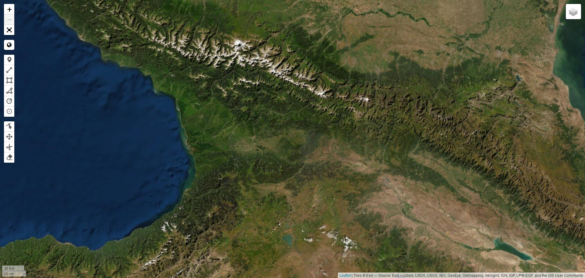
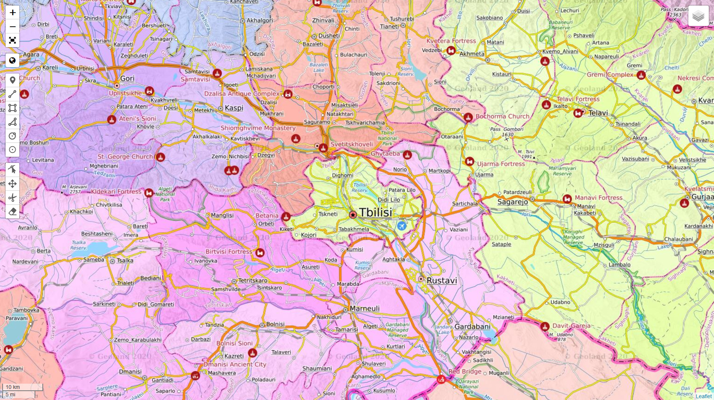
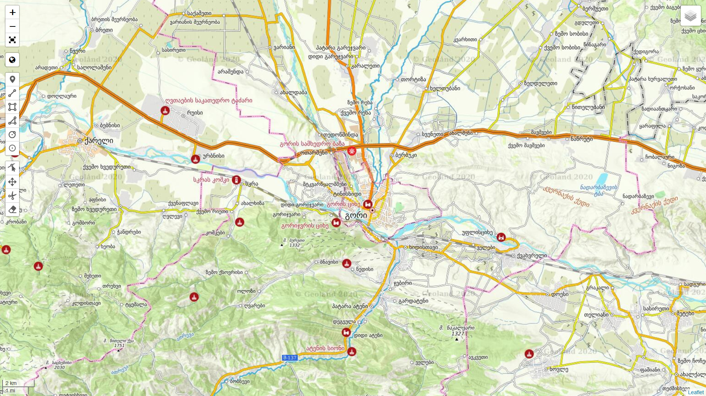

# Welcome to MyGeorgia Project Repository!

The **MyGeorgia** project aims to provide to users the best and comprehensive coverage of Georgia - for free!

### The online map characteristics 
-   Languages: **Georgian** and **English**
-   Map Themes: **General**, **Administrative**, **Physical**

### MyGeorgia Sattelite

### MyGeorgia General Map View *(English)*

### MyGeorgia Administrative Map View *(English)*

### MyGeorgia General Map Gori Centered View *(Georgian)*

